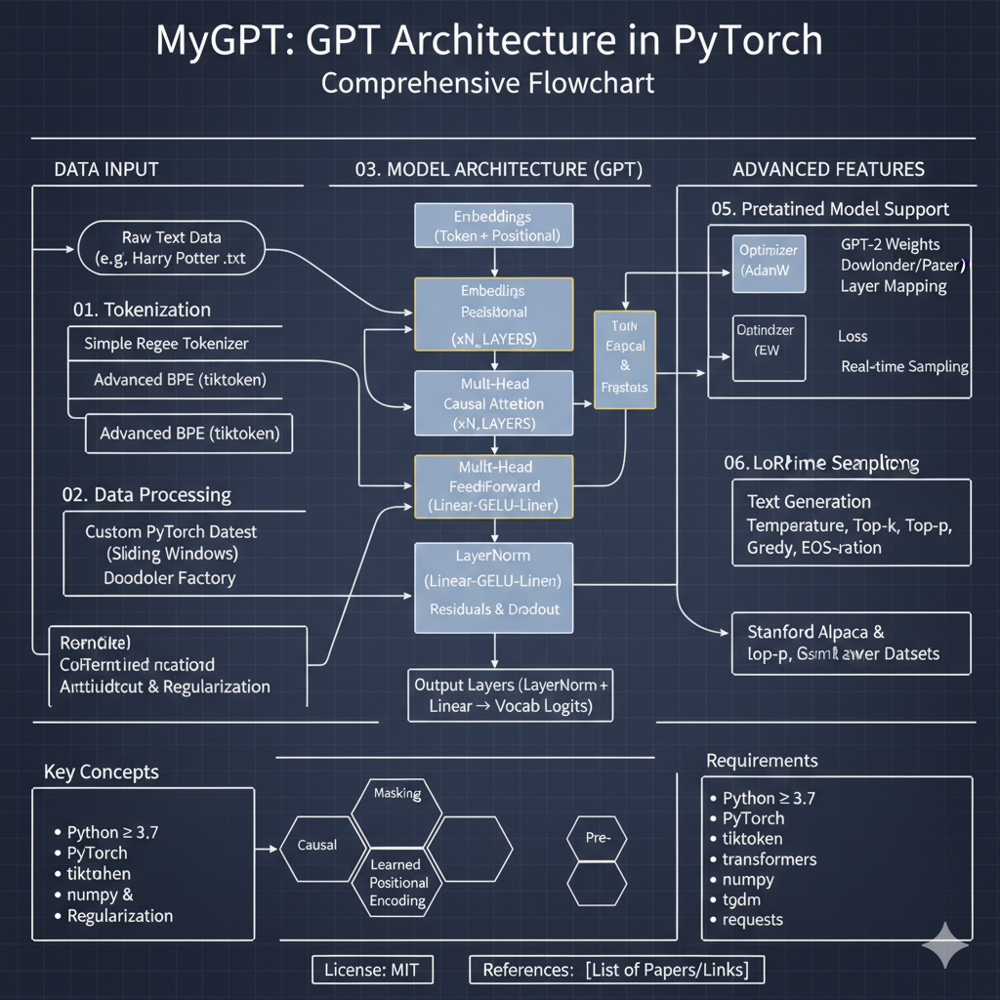

# 🧠 MyGPT

A **fully custom implementation** of the **GPT (Generative Pre-trained Transformer)** architecture in **PyTorch**.
This project includes everything from scratch-built tokenizers to advanced parameter-efficient fine-tuning, supporting both **educational** and **research** workflows for large language models.

---

## 📘 Table of Contents

* [Overview](#-overview)
* [Directory Structure](#-directory-structure)
* [Major Features](#-major-features)
* [How It Works](#-how-it-works-component-breakdown)
* [Usage Examples](#-usage-examples)
* [Configuration](#-model-configuration)
* [Advanced Highlights](#-advanced-highlights)
* [Requirements](#-requirements)
* [License](#-license)
* [References](#-references)

---

## 🧩 Overview

**MyGPT** is designed for deep learning practitioners who want to **understand, customize, or extend** transformer-based language models.

It includes:

* Modular tokenization (including BPE)
* Full transformer stack construction
* Robust training & evaluation pipelines
* Native integration with **OpenAI GPT-2** pretrained weights
* **LoRA-based fine-tuning** for efficient adaptation

---

### Architecture Flow



---

## 📂 Directory Structure

```bash
MyGPT/
├── MyGPT.ipynb                              # Main implementation notebook (model logic & experiments)
├── gpt_download3.py                         # Helper for GPT-2 weights download & parsing
├── 01 Harry Potter and the Sorcerers Stone.txt  # Sample dataset for training/testing
└── .gitignore                               # Standard ignore file
```

---

## ✨ Major Features

* 🧱 **Tokenizer Construction** – Word-level & BPE (via `tiktoken`)
* 📚 **Custom Dataset Loader** – Sliding windows, overlapping sequences, padding
* 🔡 **Embeddings** – Token + positional embeddings (GPT-2 spec)
* 🔁 **Transformer Blocks** – Multi-head attention, pre-LN, residuals, GELU activations
* 🧠 **Text Generation** – Temperature, top-k, top-p, greedy, EOS-aware sampling
* 💾 **Pretrained Weights** – Load GPT-2 Small/Medium/Large/XL
* ⚙️ **Fine-Tuning (LoRA)** – Efficient parameter adaptation via PEFT
* 🔄 **Training Pipeline** – AdamW optimizer, live sampling, evaluation support

---

## ⚙️ How It Works: Component Breakdown

### 1. Tokenization

* **Simple Tokenizer**: Regex splitting, vocab mapping, encode/decode
* **Advanced BPE**: True GPT-compatible subword tokenization using `tiktoken`

### 2. Data Processing

* Custom **PyTorch Dataset**: Generates input/target pairs using sliding windows
* Flexible **DataLoader Factory**: Configurable batch size, stride, and workers

### 3. Model Architecture

* **Embeddings**: Token + positional
* **Transformer Blocks**:

  * LayerNorm (pre-norm)
  * Multi-Head Attention (causal)
  * FeedForward (Linear → GELU → Linear)
  * Residuals & dropout
* **Output Layers**: LayerNorm + Linear → Vocab logits

### 4. Training & Generation

* Optimizer: **AdamW**
* Loss: **CrossEntropyLoss**
* Real-time sampling during training

### 5. Pretrained Model Support

* GPT-2 weights downloader and parser
* Automatic layer mapping and shape alignment

### 6. LoRA Fine-Tuning

* **PEFT integration** for low-rank adaptation
* Compatible with **Stanford Alpaca** and similar datasets

---

## 🚀 Usage Examples

### Installation

```bash
pip install torch torchvision torchaudio tiktoken transformers peft numpy tqdm requests
```

### Basic Training Loop

```python
from MyGPT import GPTModel, create_dataloader, train_model_simple

raw_text = open("01 Harry Potter and the Sorcerers Stone.txt").read()
train_loader = create_dataloader(raw_text, batch_size=8, max_length=1024)

model = GPTModel(config=GPT_CONFIG)
train_model_simple(model, train_loader, None, optimizer, device, num_epochs=10)
```

### Text Generation

```python
context = "The wizard entered the room"
ids = tokenizer.encode(context)
out = generate(model, torch.tensor([ids]), max_new_tokens=50, temperature=0.8)
print(tokenizer.decode(out[0].tolist()))
```

### Load & Fine-Tune Pretrained Weights

```python
from gpt_download3 import download_and_load_gpt2
settings, params = download_and_load_gpt2("124M", "gpt2")
load_weights_into_gpt(model, params)
```

### LoRA Fine-Tuning

```python
from peft import LoraConfig, get_peft_model, TaskType

peft_config = LoraConfig(
    task_type=TaskType.CAUSAL_LM,
    inference_mode=False,
    r=8,
    lora_alpha=16,
    lora_dropout=0.05,
    target_modules=["c_attn", "c_proj", "c_fc"]
)
model = get_peft_model(model, peft_config)
```

---

## ⚙️ Model Configuration

### GPT-2 Default

```python
GPT_CONFIG = {
    "vocab_size": 50257,
    "context_length": 1024,
    "emb_dim": 768,
    "n_heads": 12,
    "n_layers": 12,
    "drop_rate": 0.1,
    "qkv_bias": False
}
```

### Custom Small Model

```python
GPT_CONFIG_SMALL = {
    "vocab_size": 50257,
    "context_length": 256,
    "emb_dim": 384,
    "n_heads": 6,
    "n_layers": 6,
    "drop_rate": 0.1,
    "qkv_bias": False
}
```

---

## 🧠 Advanced Highlights

* **Causal Masking** – Enforces autoregressive constraint
* **Learned Positional Encoding** – Absolute position vectors up to 1024 tokens
* **Pre-LayerNorm Architecture** – Improves stability and training convergence
* **Dropout & Regularization** – On embeddings and internal blocks
* **Flexible Sampling** – Top-k, top-p, temperature, and greedy modes
* **Dynamic Collate Functions** – Handles padding & variable-length sequences

---

## 🧰 Requirements

* Python ≥ 3.7
* PyTorch ≥ 1.12
* `tiktoken`
* `transformers`
* `peft`
* `numpy`
* `tqdm`
* `requests`

---

## ⚖️ License

**MIT License**

---

## 🔗 References

* [Attention Is All You Need (Transformer)](https://arxiv.org/abs/1706.03762)
* [Stanford Alpaca Dataset](https://github.com/tatsu-lab/stanford_alpaca)
* [LoRA: Low-Rank Adaptation of Large Language Models](https://arxiv.org/abs/2106.09685)
* [OpenAI GPT-2](https://openai.com/research/better-language-models)

---

